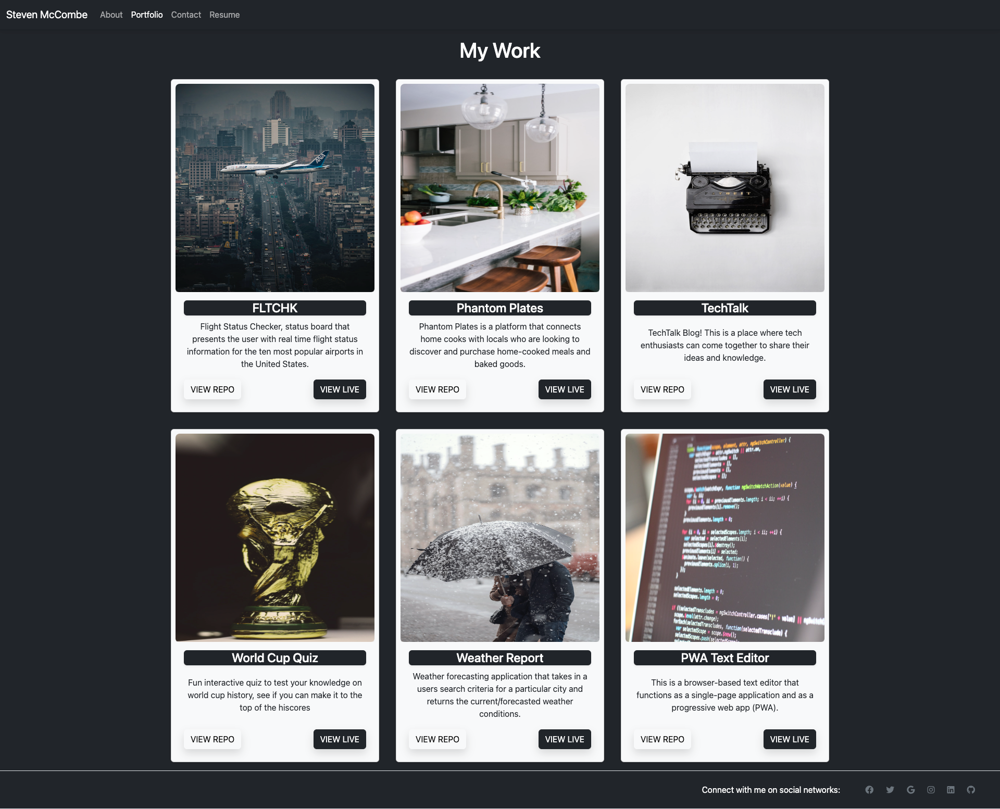

# Steven McCombe Portfolio
## Description
To showcase my web design skills for potential employers, I designed a portfolio webpage which includes a brief overview about me, upcoming and completed projects, and contact links. The webpage serves as both a responsive resume and advertisement of my skills.
## Table of Contents
* [Installation](#installation)
* [Links](#Links)
* [Usage](#usage)
* [License](#license)
* [Credits](#credits)
* [Report Bugs](#bugreport)
* [Questions](#questions)

## Installation

No Installation requirments.


## Usage
Navigate to the following URL in your browser. 
```h
https://steven-mccombe.github.io/portfoliosteven/
```


Application Screenshot:

[](https://steven-mccombe.github.io/portfoliosteven/)

## License 
   

  [Read more about MIT License here.](https://opensource.org/licenses/MIT)
  
  
## Credits
- [FrontEnd Toolkit](https://mdbootstrap.com/)
## BugReport
- [E-mail Bug Report](mailto:smccombe93@gmail.com)

## Questions
Contact Links:
- [Github Profile](https://github.com/STEVEN-MCCOMBE)
- [E-mail Me](mailto:smccombe93@gmail.com)


